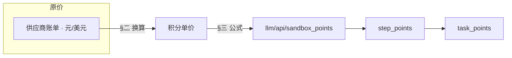

# 积分计算逻辑

> 配套：[《按实际消耗计费-产品方案》](./按实际消耗计费-产品方案.md)（产品规则与体验）  
> 代码库基准：**agent-worker-master 5.18** · 配置落地：`model_pricing.json` / `LLM_MODEL_PRICING`  
> 定价基准（2026-05）：`deepseek-v4-flash`、Gemini / 生图 / 内容读取（**CloudSway 日账单**）、豆包视觉/向量（火山方舟 Ark）、博查、AgentBay 按量。

---

## 目录

- [一、文档说明](#一文档说明)
- [二、积分锚点：元 ↔ 积分](#二积分锚点元--积分)
- [三、扣费计算公式](#三扣费计算公式)
  - [3.1 汇总层级](#31-汇总层级)
  - [3.2 单次 LLM](#32-单次-llm)
  - [3.3 单次外部 API](#33-单次外部-api)
  - [3.4 单段 Sandbox](#34-单段-sandbox)
  - [3.5 取整与实现注意](#35-取整与实现注意)
  - [3.6 算例](#36-算例)
- [四、外部原价与调用对照](#四外部原价与调用对照)
  - [4.1 LLM（Chat）](#41-llmchat)
  - [4.2 极速 / 深度 · 模型路由](#42-极速--深度--模型路由)
  - [4.3 外部 API](#43-外部-api)
  - [4.4 Sandbox（AgentBay）](#44-sandboxagentbay)
  - [4.5 本期暂不计入计费](#45-本期暂不计入计费)
- [五、积分单价与配置](#五积分单价与配置)
  - [5.1 LLM 积分单价](#51-llm-积分单价)
  - [5.2 外部 API 积分单价](#52-外部-api-积分单价)
  - [5.3 Sandbox 积分单价](#53-sandbox-积分单价)
  - [5.4 `model_pricing.json` 参考](#54-model_pricingjson-参考)
- [六、维护说明](#六维护说明)

---

## 一、文档说明

**阅读顺序**：§四 外部原价 → §二 换算规则 → §五 积分单价 → §三 扣费公式。场景级粗估见 [产品方案 §2.3](./按实际消耗计费-产品方案.md)。

| 概念 | 说明 |
| --- | --- |
| 用户侧 | 只看到一个数：**积分** |
| 平台侧 | **LLM**（token，含缓存）+ **外部 API**（次/张）+ **Sandbox**（核·时、GB·时、GB 等）分别折算后相加 |
| 定价锚 | **`1 积分 = 0.0144 元`**（288 元 = 20000 积分） |
| 美元折算 | **`1 USD = 7 CNY`**（Gemini 等） |
| 调价 | `model_pricing.json` 中的单价与 `markup` / `global_markup_*`（默认 1.0） |



**表列约定（§四）**：**模型** = `model_id`；**服务商** = 实际调用入口（百炼 / CloudSway / 博查 / AgentBay）；**单次调用成本** = 外部原价，不直接等于用户扣分。

**收录原则**：只列**生产会调用、且纳入动态积分计费（或成本建档待启用）**的项；未接入计费、无采购单价或主路径不触发的能力**不写进价目表**（避免研发/模型误生成配置）。

---

## 二、积分锚点：元 ↔ 积分

### 2.1 汇率

```
288 元 = 20000 积分  =>  1 积分 = 0.0144 元
```

内部记账固定 **0.0144**；用户购买不同 SKU 只影响实付元，不改变上式。

### 2.2 原价 → 积分单价

| 计量类型 | 公式 |
| --- | --- |
| 元 / 百万 Token → 积分 / 千 Token | `points_per_k = 原价(元/百万) / 1000 / 0.0144` |
| 美元 / 百万 Token | `points_per_k = (美元价 × 7) / 1000 / 0.0144` |
| 元 / 次（或 / 张） | `points_per_call = 原价(元) / 0.0144` |
| 元 / 核·时、元/GB·时 等 | `points = 原价 / 0.0144` |

**示例**：博查 ¥0.036/次 → **2.5** 积分/次，`ceil` 后扣 **3** 积分；CloudSway `MaaS_Ge_3_flash` 输入 $0.50/M → **0.2431** 积分/千 token；百炼 `deepseek-v4-flash` 隐式缓存命中 0.2 元/M → **0.0139** 积分/千 token；内容读取 ¥0.0098/次 → **0.68** 积分/次。

### 2.3 加成系数（默认 1.0）

| 层级 | 配置键 |
| --- | --- |
| 单项 | `model_markup_*` / `service_markup` / `resource_markup` |
| 分类 | `global_markup_llm` / `global_markup_api` / `global_markup_sandbox` |
| 全局 | `global_markup` |

**顺序**：折算积分 → × 单项 markup → × 分类 markup → `ceil`（§3.5）→ × `global_markup`（在**单次调用**上）→ 步骤内求和。

---

## 三、扣费计算公式

与 [产品方案 §2.2](./按实际消耗计费-产品方案.md) 一致。

### 3.1 汇总层级

```
task_points = Σ_steps step_points
step_points = Σ_i llm_points_i + Σ_j api_points_j + Σ_k sandbox_points_k
```

- **步骤**：每个 subagent 完成一次工作 = 一步（`step_billing_success`）。
- 各 `*_points_*` **已含**加成与取整；**任务级不再**乘 `G_llm` / `G_global`（避免重复加成）。

### 3.2 单次 LLM

`tok_*` = **千 token**（`input_tokens / 1000`）。

```
llm_points_i = ceil(
    (tok_in·p_in·mm_in + tok_out·p_out·mm_out
   + tok_cache_hit·p_cache_hit·mm_cache_hit
   + tok_cache_create·p_cache_create·mm_cache_create) × G_llm
) × G_global
```

**缓存**：仅计入供应商 **单独 line item** 的 `cache_*_tokens`；勿与 `input_tokens` 重复。`deepseek-v4-flash` 生产走百炼**隐式缓存**（命中 **20%** 输入价）；未单独拆分的写入量按普通输入价计费，**不**使用显式缓存 125% / 10% 档位。

### 3.3 单次外部 API

```
api_points_j = ceil(p_call × service_markup × G_api) × G_global
```

### 3.4 单段 Sandbox

```
sandbox_points_k = ceil(
    cpu_h·p_cpu + mem_gbh·p_mem + bw_gb·p_bw + stg_gibh·p_stg + sandbox_llm_pts
) × resource_markup × G_sbx × G_global
```

### 3.5 取整与实现注意

| 层级 | `ceil` |
| --- | --- |
| 单次 LLM / API / 沙箱段 | **是** |
| 步骤 / 任务 | 否（整数之和） |

1. `G_global ≠ 1` 时可能对 `step_points` **再 ceil** 以保证扣费为整数。  
2. 勿用 `task_points = ⌈(Σ base)·G_llm⌉ × G_global`，易与单次加成重复。

### 3.6 算例

gemini-3-flash：15k in / 6k out；2C4G × 5 min；markup = 1.0。

```
llm_points  = ceil(15×0.2431 + 6×1.4583) = 13
sandbox_pts = ceil(2×8.33×5/60 + 4×3.47×5/60) = 3
step_points = 16 积分  ≈ ¥0.23
```

---

## 四、外部原价与调用对照

**代码入口**：`sources/utils/llm.py` → `get_model("MAIN" | …)`；`image_agent` → `generate_image_asset`（`EXPRESS_IMAGE_*` / `DEEP_IMAGE_*`）；`attachment_service.py` → `VISION_LLM_*`；`embedding_service.py` → `EMBED_LLM_*`（方舟 Ark）。

### 4.1 LLM（Chat）

| 模型 | 应用场景 | 服务商 | 单次调用成本（原价） | 成本参考 |
| --- | --- | --- | --- | --- |
| **deepseek-v4-flash** | 主 Agent / 澄清 / 建议（`MAIN` `CLARIFICATION` `SUGGESTION`） | **阿里云百炼** | 输入 **1** 元/M · 输出 **2** 元/M · **隐式缓存命中 0.2** 元/M（输入价 **20%**）；写入未命中部分按输入价 **100%** 计（无显式 125% 档） | [百炼定价](https://help.aliyun.com/zh/model-studio/model-pricing#a1bcf5bff1ghg) · [隐式缓存](https://help.aliyun.com/zh/model-studio/context-cache) |
| **gemini-3-flash-preview**<br>（`MaaS_Ge_3_flash_preview_20251217`） | 原型 / React / 文档 / 调研 / HTML 编辑 / 墨刀解析等子 Agent | **CloudSway** | 输入 **`in_token` $0.50**/M · 输出 **`out_token` $3**/M · 缓存读 **`in_cache_read` $0.05**/M | CloudSway 日账单 |
| **gemini-3.1-pro-preview**<br>（`MaaS_Ge_3.1_pro_preview_20250219`） | 深度模式：主 Agent / 原型 / HTML / React 等 | **CloudSway** | 输入 **$2**/M · 输出 **$12**/M | CloudSway 日账单 |
| **doubao-seed-1-6-flash-250828** | 附件图片描述（`VISION_LLM_PROVIDER_MODEL`） | **火山方舟 Ark** | 按**输入长度**分档（元/百万，非音频）：**[0, 32]k** 输入 0.15 · 输出 1.50；**(32, 128]k** 0.30 / 3.00；**(128, 256]k** 0.60 / 6.00；缓存命中 **0.03** · 缓存存储 **0.017**/M·时 | [方舟在线推理定价](https://www.volcengine.com/docs/82379/1544106) |
| **gemini-3.1-flash-image-preview**<br>（`MaaS_Ge_3.1_flash_image_preview_20260226`） | 生图 skill · 深度（`DEEP_IMAGE_*` / `image-agent`） | **CloudSway** | 输入 **`in_token` $0.50**/M · 文本输出 **`out_token` $3**/M · 图像输出 **`out_token_image` $60**/M | CloudSway 日账单 |
| **doubao-embedding-text-240715** | 附件向量化（`EMBED_LLM_PROVIDER_MODEL`，用户上传附件解析，dim=2560） | **火山方舟 Ark** | **0.0005 元/千 token**（文本向量通用价） | [方舟知识库计费](https://www.volcengine.com/docs/82379/1099475) |

> `deepseek-v3-2-251201` 已废弃，由 **deepseek-v4-flash** 替代。  
> **视觉 / Embedding** 不走 `get_model` 主路由；附件图片描述走 `VISION_LLM_*`，向量化走 `EMBED_LLM_*`。

### 4.2 极速 / 深度 · 模型路由

| 模式 | MAIN / CLARIFICATION / SUGGESTION | 子 Agent | 深度升级 |
| --- | --- | --- | --- |
| **极速** | deepseek-v4-flash（百炼） | gemini-3-flash（CloudSway） | — |
| **深度** | gemini-3.1-pro（CloudSway） | gemini-3-flash | 主链路 / 原型等升为 3.1-pro |

### 4.3 外部 API

| 服务 | 应用场景 | 服务商 | 原价 | 参考 |
| --- | --- | --- | --- | --- |
| **bocha-web-search** | `web_search`（国内） | 博查 AI | **¥0.036/次** | 博查目录价 |
| **web-search** | `web_search`（海外） | CloudSway / Google | **¥0.036/次** | 对标博查价格 |
| **web_fetch** | 内容读取（国内） | CloudSway Reader | **¥0.0098/次** | CloudSway 账单（国内版） |
| **content_fetch** | 内容读取（海外） | CloudSway Reader | **$0.002/次** | CloudSway 账单（海外版） |
| **qwen-image-2.0** | 生图 skill · 极速 | 阿里云百炼 | **¥0.2/张** | [百炼图像定价](https://help.aliyun.com/zh/model-studio/model-pricing#a53b4db0082zs) |
**调研典型链**：博查 × N → CloudSway 抓取 × M → gemini-3-flash 总结。

### 4.4 Sandbox（AgentBay）

生产：**AgentBay** 按量；本地：**docker_sandbox** 无三方账单。

| 资源 | 应用场景 | 原价 | 参考 |
| --- | --- | --- | --- |
| CPU | 沙箱会话 | **0.12 元/核/小时** | [AgentBay 计费](https://help.aliyun.com/zh/agentbay/product-overview/agentbay-billing-instructions) |
| 内存 | 沙箱会话 | **0.05 元/GB/小时** | 同上 |
| 高级带宽（入） | 流量 | **0.8 元/GB** | 同上 |
| 存储 | Context / Replay 超额 | **0.0002 元/GiB/小时** | 同上 |

> 主路径为外部 LLM + AgentBay **CPU / 内存 / 带宽 / 存储**；AgentBay 内置 Browser/Mobile Agent 的 Credits **不在**动态积分计费范围。权益包月费（Pro ¥999 / Ultra ¥1499）为固定成本，**不计入**单次任务公式。

### 4.5 本期暂不计入计费

> 下列能力**不写入** §四 价目表与 `model_pricing.json`（避免与生产扣费不一致）。

| 类别 | 说明 |
| --- | --- |
| **STT / 语音转文字** | 本期不折算、不扣费 |
| **向量库 / WeKnora RAG** | 向量库检索、WeKnora RAG 服务本身**暂不计入**动态积分（附件向量化 `doubao-embedding-text-240715` 已纳入计费） |
| **AgentBay 权益包月费** | 固定成本，不进按次公式 |

---

## 五、积分单价与配置

下表由 §四 原价经 §二 公式折算，`global_markup` 系列默认 **1.0**。**CloudSway 项以日账单 On Demand 单价为准**（`1 USD = 7 CNY`）。

### 5.1 LLM 积分单价

配置键：`llm_models.<id>.input_points_per_k` 等。

| 模型 | 原价摘要（元/百万） | input/k | output/k | cache 命中/k | cache 创建/k | 备注 |
| --- | --- | --- | --- | --- | --- | --- |
| **deepseek-v4-flash** | 1 / 2；隐式命中 0.2（20% 输入） | **0.0694** | **0.1389** | **0.0139** | **0.0694** | 隐式写入=输入价 100%；`cache_creation` 与 `input` 同价 |
| **gemini-3-flash-preview** | $0.50 / $3；`in_cache_read` $0.05（×7） | **0.2431** | **1.4583** | **0.0243** | **0** | `in_cache_read` 对应 `cache_hit`；创建账单未单列 |
| **MaaS_Ge_3_flash_preview_*** | 同 flash | 0.2431 | 1.4583 | 0.0243 | 0 | 账单别名 |
| **gemini-3.1-pro-preview** | $2 / $12（×7） | **0.9722** | **5.8333** | — | — | 账单未列 cache 分项 |
| **doubao-seed-1-6-flash-250828** | [0,32]k：0.15 / 1.50（元/百万） | **0.0104** | **0.1042** | **0.0021** | — | 缓存存储 0.017/M·时另计；**(32,128]k** → 0.0208 / 0.2083；**(128,256]k** → 0.0417 / 0.4167（按 `input_tokens` 选档） |
| **gemini-3.1-flash-image-preview** | $0.50 / $3 / $60（×7） | **0.2431** | **1.4583** | — | — | 图像输出 `output_image_points_per_k` **29.1667**；无缓存分项 |
| **doubao-embedding-text-240715** | 0.0005 元/千 token | **0.0347** | **0** | — | — | 仅 input；附件向量化扣费 |

### 5.2 外部 API 积分单价

配置键：`api_prices.<service>.points_per_call`。

| 服务 | 原价 | points_per_call | 服务商 |
| --- | --- | --- | --- |
| bocha_search | ¥0.036/次 | **2.5** | 博查 |
| web_search | ¥0.036/次 | **2.5** | CloudSway |
| web_fetch | ¥0.0098/次 | **0.68** | CloudSway (CN) |
| content_fetch | $0.002/次 | **0.97** | CloudSway (Global) |
| qwen_image_2_0 | ¥0.2/张 | **13.89** | 百炼 |

### 5.3 Sandbox 积分单价

| 资源 | 原价 | 积分单价 | 配置键 |
| --- | --- | --- | --- |
| CPU | 0.12 元/核/时 | **8.33** | `cpu_points_per_core_hour` |
| 内存 | 0.05 元/GB/时 | 3.47 | `mem_points_per_gb_hour` |
| 带宽（入） | 0.8 元/GB | 55.56 | `bw_points_per_gb` |
| 存储 | 0.0002 元/GiB/时 | 0.0139 | `storage_points_per_gib_hour` |

### 5.4 `model_pricing.json` 同测试环境已有结构

---

## 六、维护说明

1. **改价顺序**：先更新 §四 原价与参考链接 → 按 §二 重算 §五 积分列 → 同步 `model_pricing.json`（或由 [定价配置后台](./积分定价配置后台-产品方案.md) 发布）。任务级预估见 [产品方案 §2.3](./按实际消耗计费-产品方案.md)，不在本文维护分步样例。  
2. **服务商列**：只写调用入口（百炼 / CloudSway / 博查 / AgentBay / 火山方舟），不写模型原厂。  
3. **CloudSway**：Gemini / 生图 / 内容读取以**日账单 On Demand**为准；改价后同步 §五 与《模型调用成本清单》。核对时区分 **`in_token`（普通输入）** 与 **`in_cache_read`（缓存读）**，勿将 $0.05 误作输入价。  
4. **核对命令**（在 agent-worker 目录）：`rg "get_model\\(|WEB_SEARCH|WEB_FETCH|SANDBOX_PROVIDER|EXPRESS_IMAGE|DEEP_IMAGE|image-agent" sources`  
5. **不计费项**：STT、向量库/WeKnora RAG 检索、AgentBay Credits/权益包月费 — 见 §4.5；**勿写入**价目表。  
6. **产品规则**（扣费时机、明细展示、启动余额校验、新用户赠送等）见 [产品方案](./按实际消耗计费-产品方案.md)。

*文档版本：2026-05；agent-worker-master 5.18；DeepSeek V4 生产路由。*
